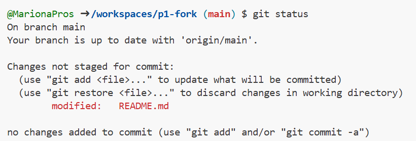
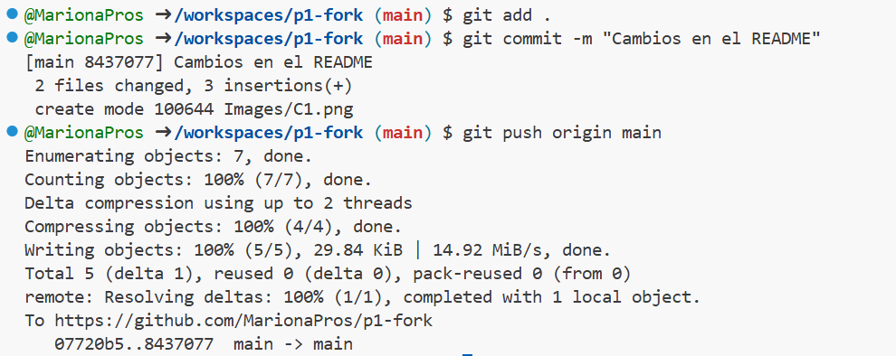
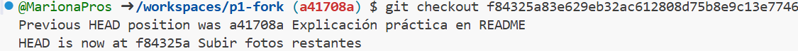

# Práctica 1

Un repositorio para empezar a usar [git](https://git-scm.com/) y Github

## ¿Como probar en la nube?

[Github-Codespaces](https://github.com/features/codespaces)

## Comandos git básicos

```
git clone https://github.com/gitt-3-pat/p1
git status
git add .
git commit -m "TU MENSAJE"
git push

git checkout -b feature/1
git checkout main
```

## ¿Cómo escribir un README.md con formato?

[Github Markdown](https://docs.github.com/es/get-started/writing-on-github/getting-started-with-writing-and-formatting-on-github/basic-writing-and-formatting-syntax)

## Imágenes comandos practica 1



El comando git status se usa para ver que archivos o cambios están pendientes por subir. Por ejemplo, en esta imagen te dice que se ha realizado una modificación en el archivo README.md y se debe de hacer un commit.



En esta segunda imagen se observan distintos comandos:
1) git add-> Hace una "fotografía" de todos aquellos archivos sobre los cuales se han realizado cambios y los prepara para hacerles commit. El punto es porque seleccionas todos los archivos que han sido modificados, no uno en concreto.
2) git commit -m "Mensaje"-> Este comando guarda los cambios localmente junto con un mensaje, lo cual los hace más fácil de identificar posteriormente.
3) git push origin main-> Sube los datos al repositorio remoto en Github, donde se guarda todo. El main es la rama donde queremos que se guarden los cambios.




El comando git checkout "id del commit" nos permite movernos entre distintos commits, es decir, puedes volver a un commit realizado anteriormente, o posteriormente.

Por último, el comando git clone "dirección que se quiere clonar" no lo he realizado puesto que ya he hecho un fork de es repositorio anteriormente desde el entorno gráfico, y si lo vuelvo a clonar me da problemas, puesto que estaría guardando un repositorio(el clonado) dentro de otro repositorio, en mi caso, p1-fork.